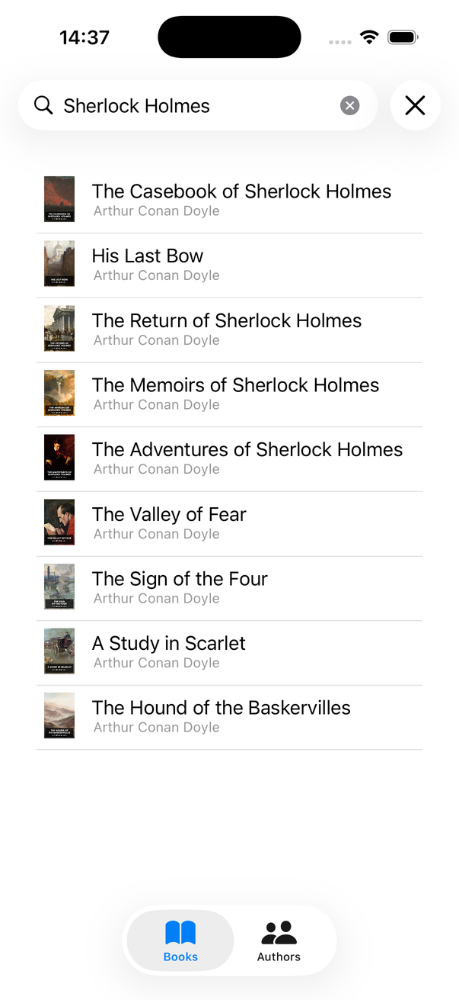

# opdsreader

A small SwiftUI client for OPDS book catalogs. Search books and authors, browse an author's shelf, open the book page with cover and description, download the file (EPUB / FB2 zip / DjVu) or jump to any of the catalog's links. Started in January 2023 as a weekend project to try SwiftUI + Combine against a real feed; kept up to date with iOS 26.

<p align="center">
  
  
  
</p>

## How it works

- **OPDS 1 via Readium** — `OPDS1Parser` from [readium/swift-toolkit](https://github.com/readium/swift-toolkit) turns Atom feeds into `Publication`s; `OpdsService` maps them to a tiny `Book` model (title, authors, cover, description, best download link, all links).
- **Download link selection** — `Link.first(withMediaType:)` picks EPUB, then ZIP, then DjVu / DjVu-zip (`Extensions/MediaType+Extension.swift`), so the "Download" button always opens the most useful acquisition link.
- **Author shelves** — `getBooksByAuthor` walks the author's navigation feed recursively (alphabet → series → books) and flattens the result.
- **Search UX** — `SearchScreenViewModel` debounces the query with Combine (200 ms), paginates on scroll (`fetchMore` when the last item appears), and keeps separate Books / Authors tabs in a `TabView`.
- **Covers** — `CachedAsyncImage` for list thumbnails and the detail page.
- Descriptions may arrive as HTML from some catalogs; they are rendered as plain text (`String.strippingHTML()`).

Default catalog is Flibusta (Russian-language). Point `OpdsService` at any OPDS 1 catalog with a search endpoint — the screenshots above were taken against [Standard Ebooks](https://standardebooks.org/feeds/opds).

There is also a Compose Multiplatform port of the same app: [opds-kmm-v2](https://github.com/nickspopov/opds-kmm-v2).

## Layout

```
opdsreader/
├── Screens/       SearchScreen (tabs), BookDetailsScreen, AuthorDetailsScreen
├── Components/    SearchItem, AuthorSearchItem, EmptyImage
├── ViewModels/    SearchScreenViewModel (Combine debounce, pagination)
├── Services/      OpdsService (Readium OPDS parser → Book / AuthorShort)
└── Extensions/    MediaType helpers, View helpers, String.strippingHTML
```

SwiftUI, Combine, Readium swift-toolkit 2.4, swiftui-cached-async-image. iOS 26, Xcode 26.

## Run

Open `opdsreader.xcodeproj`, pick your team in Signing, run. No configuration needed.

## License

MIT © Nick Popov
